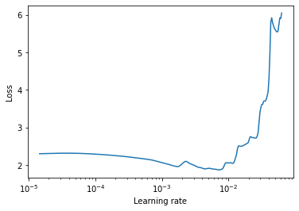
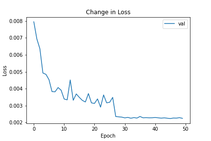
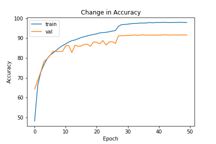
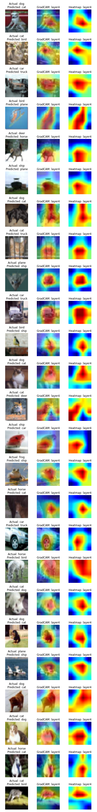
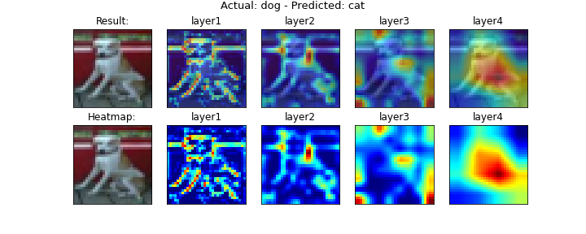
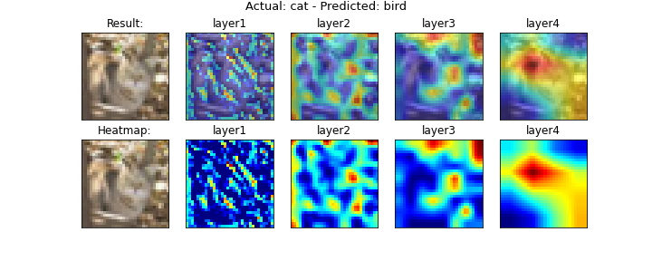
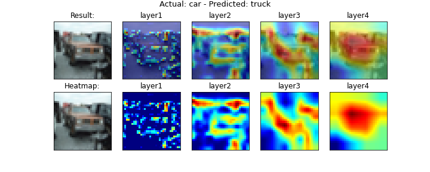
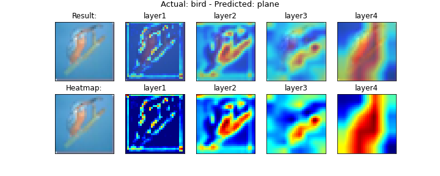
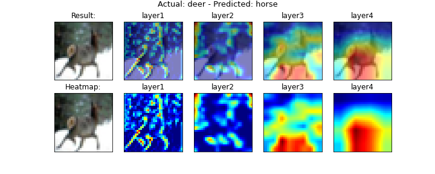

# Session 10 - Training and Learning Rates

###	Objective
Achieve an accuracy of **88%** on the **CIFAR-10** dataset using **ResNet18**:

- Use Leslie Smith LR finder to find the best starting learning rate
- Use ReduceLROnPlateau

###  Parameters and Hyperparameters

- Loss Function: Cross Entropy Loss
- Optimizer: SGD
- Scheduler: ReduceLROnPlateau
- Batch Size: 128
- Epochs: 50
- Dropout: 0.15
- L1 decay: 3e-6
- L2 decay: 1e-3

### Image Augmentation Techniques

- Horizontal Flip: p=0.5
- Hue Saturation Value: p=0.25
- Rotate: limit=15, p=0.5
- Coarse Dropout: holes=1, h=(4,16), w=(4,16), p=0.75

### Learning Rate Parameters
ReduceLROnPlateau:
- mode: min
- factor: 0.1
- patience: 3
- min_lr: 1e-5

### Results
Achieved  an accuracy of **91.75%** in 43rd epoch.

#### LR Finder
- Best Loss: 1.876451529501383
- Best Learning Rate: 0.007255346038874367

#### Change in Loss

#### Change in Accuracy

### GradCAM Visualizations

Visualize GradCAM at different convolutional layers to understand where the network is looking at while prediction.

#### Misclassified Images

##### GradCAM at different convolutional layers for the class: *Cat*

| Truth: Dog, Predicted: Cat |
|---|
|  |

##### GradCAM at different convolutional layers for the class: *Bird*

| Truth: Cat, Predicted: Bird |
|---|
|  |

##### GradCAM at different convolutional layers for the class: *Truck*

| Truth: Car, Predicted: Truck |
|---|
|  |

##### GradCAM at different convolutional layers for the class: *Plane*

| Truth: Bird, Predicted: Plane |
|---|
|  |

##### GradCAM at different convolutional layers for the class: *Horse*

| Truth: Deer, Predicted: Horse |
|---|
|  |
