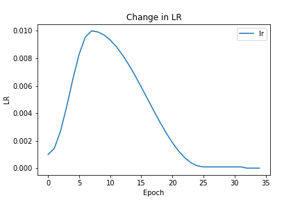
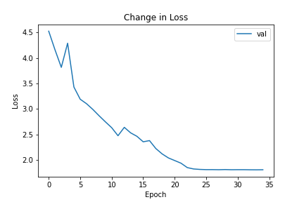
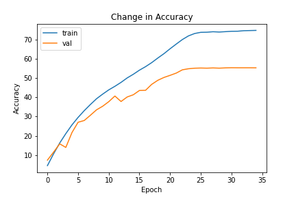
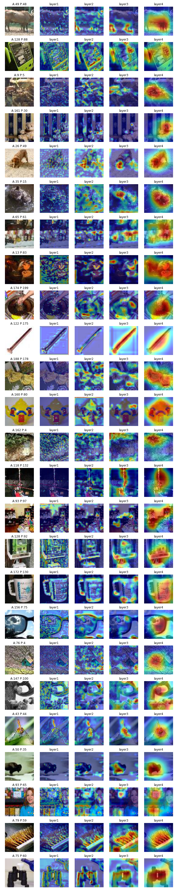
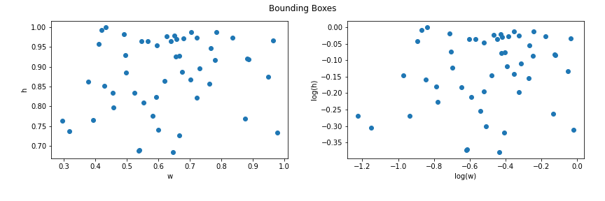
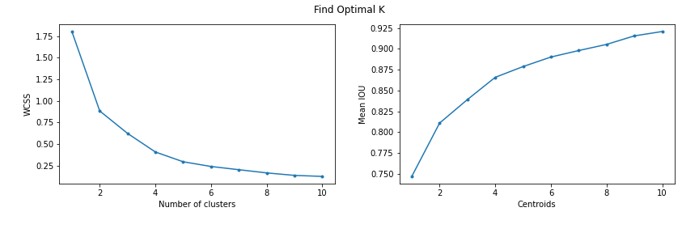
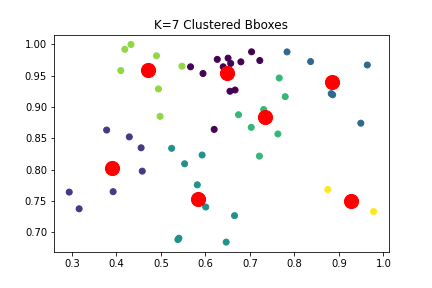

# Session 11 - Object Localization

## Assignment A
[](https://colab.research.google.com/github/uday96/EVA4-TSAI/blob/master/S12/EVA4_S12_A_Solution.ipynb)

###	Objective
Achieve an accuracy of **50%** on the **tiny-imagenet-200** dataset using:

- Download dataset from - http://cs231n.stanford.edu/tiny-imagenet-200.zip
- Split the data to 70% - 30% train and test
- Use ResNet architecture

###  Parameters and Hyperparameters
- Loss Function: Cross Entropy
- Optimizer: SGD
- Scheduler: OneCycleLR, ReduceLROnPlateau
- Batch Size: 256
- Epochs: 30 (OneCycleLR) + 10 (ReduceLROnPlateau)
- L2 decay: 5e-3

### Image Augmentation Techniques
- Pad: h=72, w=72, p=1.0
- RandomCrop: h=64, w=64, p=1.0
- Horizontal Flip: p=0.25
- Rotate: limit=15, p=0.5
- RGBShift: (20, 20, 20), p=0.25
- Coarse Dropout: holes=1, h=8, w=8, p=0.75

### Learning Rate Parameters
OneCycleLR:
- max_lr: 0.01
- div_factor: 10
- final_div_factor: 10
- anneal_strategy: cos
- pct: 10/30

ReduceLROnPlateau:
- mode: min
- factor: 0.5
- patience: 1
- min_lr: 1e-5

### Results
Achieved  an accuracy of **58.89%** in 39th epoch.

#### Change in Learning Rate


#### Change in Loss


#### Change in Accuracy


### GradCAM Visualizations

Visualize GradCAM at different convolutional layers to understand where the network is looking at while prediction



## Assignment B
[](https://colab.research.google.com/github/uday96/EVA4-TSAI/blob/master/S12/EVA4_S12_B_Solution.ipynb)

###	Objective

Find optimal template anchor boxes for a custom dataset of 50 dogs:

- Download 50 images of dogs
- Annotate the images using: [http://www.robots.ox.ac.uk/~vgg/software/via/via_demo.html](http://www.robots.ox.ac.uk/~vgg/software/via/via_demo.html)
- Cluster the scaled bounding boxes and compute mean IOU (Intersection Over Union)

### Resource Files
- The custom dataset of 50 dogs can be found at: [data/annotations/dogs](https://github.com/uday96/EVA4-TSAI/blob/master/S12/data/annotations/dogs)
- The annotations for all the images can be found at: [data/annotations/annotations_dogs.json](https://github.com/uday96/EVA4-TSAI/blob/master/S12/data/annotations/annotations_dogs.json)
- The complete image bounding box data can be found at: [data/annotations/bboxes_dogs.csv](https://github.com/uday96/EVA4-TSAI/blob/master/S12/data/annotations/bboxes_dogs.csv)

### Bounding Boxes
Visualise the scaled bounding boxes of all the images


### Finding Best Bounding Box
Use Elbow method and Mean IOU to find out the optimal number of clusters


### Best Fit for Template Anchor Boxes
k=7 looks like the best fit for the number of anchor boxes
```
Centroids:
[[0.64857487 0.95483271]
 [0.38918022 0.80225897]
 [0.88347826 0.94057948]
 [0.58260932 0.75270229]
 [0.73395483 0.88481587]
 [0.47028511 0.95885636]
 [0.92638889 0.75090312]]

Mean IOU: 0.8979057995199584
```

