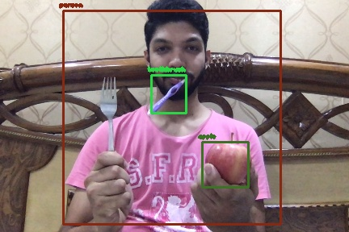
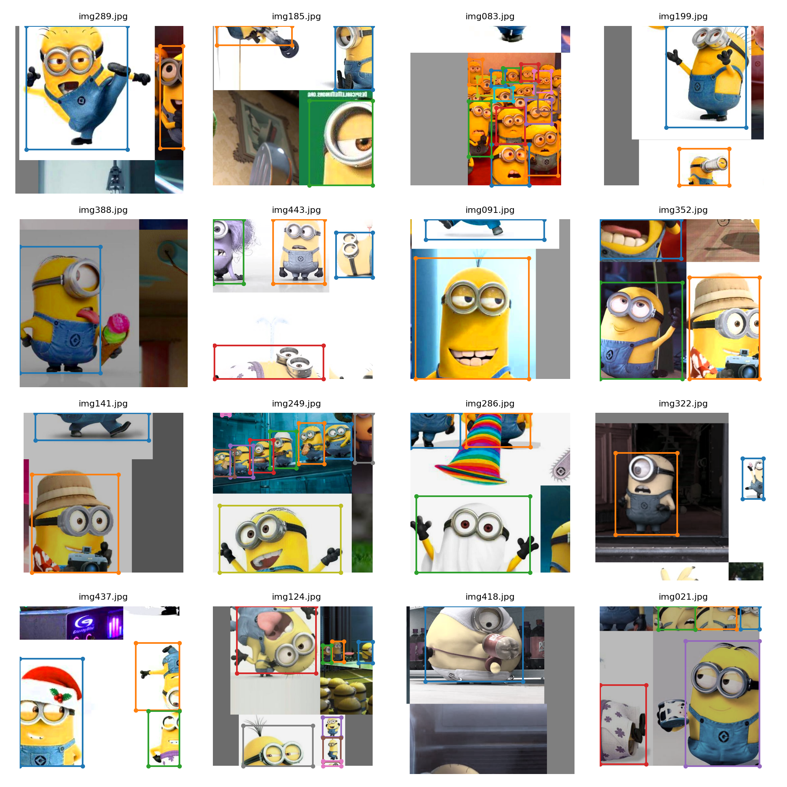
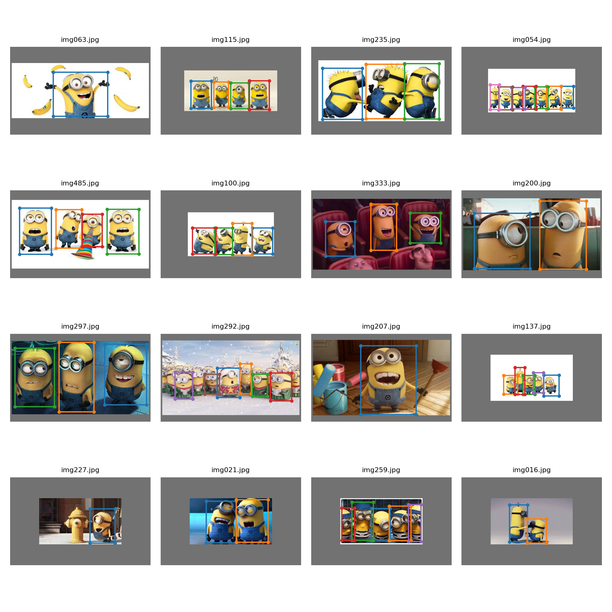
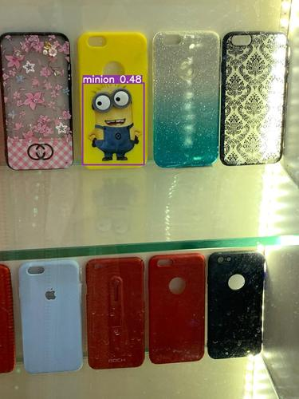
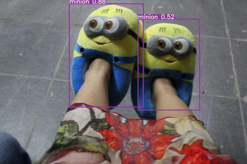
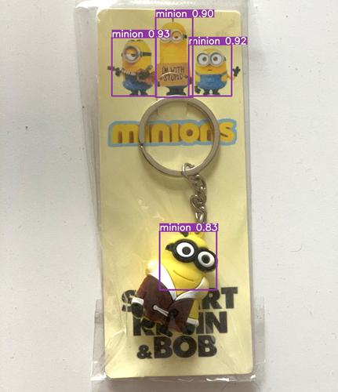

# Session 13 - YoloV2&3

## Assignment A

###	Objective

OpenCV Yolo: [SOURCE ](https://pysource.com/2019/06/27/yolo-object-detection-using-opencv-with-python/)

1.  Run this above code.
2.  Take an image of yourself, holding another object which is there in COCO data set (search for COCO classes to learn).
3.  Run this image through the code above.
4.  Upload the link to GitHub implementation of this
5.  Upload the annotated image by YOLO.

### Annotated Image
The classes "**person**", "**apple**" and "**toothbrush**" were detected successfully. However, "**fork**" was not detected.

## Assignment B

###	Objective
Training Custom Dataset on for YoloV3

1.  Refer to this Colab File:  [LINK ](https://colab.research.google.com/drive/1LbKkQf4hbIuiUHunLlvY-cc0d_sNcAgS)
2.  Refer to this GitHub  [Repo](https://github.com/theschoolofai/YoloV3)
3.  Collect a dataset of 500 images and annotate them.  **Please select a class for which you can find a YouTube video as well.** Steps are explained in the readme.md file on GitHub.
4.  Once done:
    1.  [Download](https://www.y2mate.com/en19)  a very small (~10-30sec) video from youtube which shows your class.
    2.  Use  [ffmpeg](https://en.wikibooks.org/wiki/FFMPEG_An_Intermediate_Guide/image_sequence)  to extract frames from the video.
    3.  Inter on these images using detect.py file.
    4.  Use  [ffmpeg](https://en.wikibooks.org/wiki/FFMPEG_An_Intermediate_Guide/image_sequence)  to convert the files in your output folder to video

### Resources
- Created a custom dataset of 500 images of **minions**.
- Annotated the custom dataset using [https://github.com/miki998/YoloV3_Annotation_Tool](https://github.com/miki998/YoloV3_Annotation_Tool)
- Trained YoloV3 using [https://github.com/uday96/YoloV3](https://github.com/uday96/YoloV3) which was forked from [https://github.com/theschoolofai/YoloV3](https://github.com/theschoolofai/YoloV3)
- The entire custom data, annotated results and network config can be found at [https://github.com/uday96/YoloV3](https://github.com/uday96/YoloV3) (branch="**minion**")

### Results

#### Visualise Train Batch

#### Visualise Test Batch

#### YouTube Video
A video of minions found on YouTube was passed through the trained model. The video can be found at [https://youtu.be/WRHMwZyMcu4](https://youtu.be/WRHMwZyMcu4)

#### Detection on Unseen Images
Tried to perform object detection on few unseen photos clicked on my camera and from the internet

