# Session 14-15 - RCNN

###	Objective
Create a custom dataset for monocular depth estimation and segmentation simultaneously.

1.  **Background (bg):** Select "scene" images. Like the front of shops, etc. Download 100 such backgrounds.
2.  **Foreground (fg):** Find or make 100 images of objects with transparent background.
3.  **Foreground mask (fg_mask):** Create 100 masks, one per foreground.
4.  **Foreground overlayed on background (fg_bg):** Overlay the foreground on top of background randomly. Flip foreground as well. We call this fg_bg.
5.  **Foreground overlayed on background mask (fg_bg_mask):**. Create equivalent masks for fg_bg images.
6. **Foreground overlayed on background depth maps (fg_bg_depth):** Create equivalent depth maps for fg_bg images.

### Dataset Creation

#### Background (bg)
 - 100 images of streets were downloaded from the internet.
 - Each image was resized to 224 x 224
 - Number of images: 100
 - Image dimensions: (224, 224, 3)
 - Directory size: 2.5M
 - Mean: [0.5039, 0.5001, 0.4849]
 - Std: [0.2465, 0.2463, 0.2582]

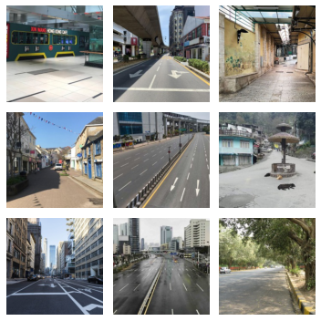

#### Foreground (fg)
 - 100 images of footballers were downloaded from the internet.
 - Using GIMP, the foreground was cutout. and the background was made transparent by adding an alpha layer.
 - Each image was rescaled to keep height 105 and resizing width while maintaining aspect ratio.
 - Number of images: 100
 - Image dimensions: (105, width, 4)
 - Directory size: 1.2M

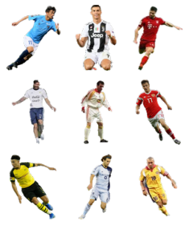

#### Foreground Mask (fg_mask)
 - For every foreground its corresponding mask was created
 - Using GIMP, the foreground was filled with white and the background was filled with black.
 - Image was stored as a grayscale image.
 - Each image was rescaled to keep height 105 and resizing width while maintaining aspect ratio.
 - Number of images: 100
 - Image dimensions: (105, width)
 - Directory size: 404K

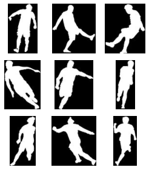

#### Foreground Overlayed on Background (fg_bg)
 - For each background
	 - Overlay each foreground randomly 20 times on the background
	 - Flip the foreground and again overlay it randomly 20 times on the background
 - Number of images: 100\*100\*2\*20 = 400,000
 - Image dimensions: (224, 224, 3)
 - Directory size: 4.2G
 - Mean: [0.5056, 0.4969, 0.4817]
 - Std: [0.2486, 0.2490, 0.2604]

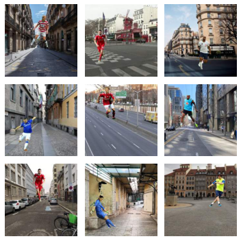

#### Foreground Overlayed on Background Mask (fg_bg_mask)
 - For every foreground overlayed on background, its corresponding mask was created.
 - The mask was created by pasting the foreground mask on a black image at the same position the foreground was overlayed.
 -  Image was stored as a grayscale image.
 - Number of images: 400,000
 - Image dimensions: (224, 224)
 - Directory size: 1.6G
 - Mean: [0.0454]
 - Std: [0.2038]

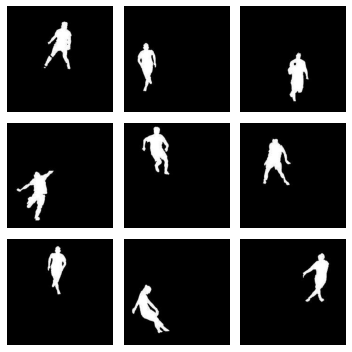

#### Foreground Overlayed on Background Depth Map (fg_bg_depth)
 - For every foreground overlayed on background, its corresponding depth map was generated.
 - A pre-trained monocular depth estimation model [DenseDepth](https://github.com/ialhashim/DenseDepth/blob/master/DenseDepth.ipynb) was used to generate the depth maps.
 - Image was stored as a grayscale image.
 - Number of images: 400,000
 - Image dimensions: (224, 224)
 - Directory size: 1.6G
 - Mean: [0.4334]
 - Std: [0.2715]

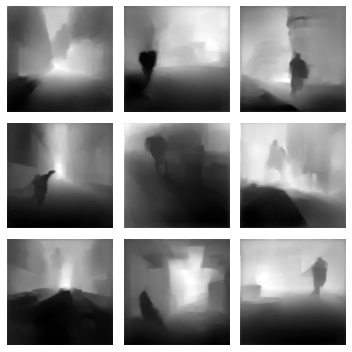

### Dataset Statistics

|  | # | dim | mean | std | size | img |
|---|---|---|---|---|---|---|
| **bg** | 100 | (224,224,3) | (0.5039, 0.5001, 0.4849) | (0.2465, 0.2463, 0.2582) | 2.5M | 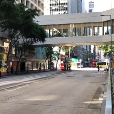 |
| **fg** | 100 | (105,w,4) |  |  | 1.2M |  |
| **fg_mask** | 100 | (105,w) |  |  | 404K |  |
| **fg_bg** | 400k | (224,224,3) | (0.5056, 0.4969, 0.4817) | (0.2486, 0.2490, 0.2604) | 4.2G |  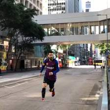 |
| **fg_bg_mask** | 400k | (224,224) | (0.0454) | (0.2038) | 1.6G | 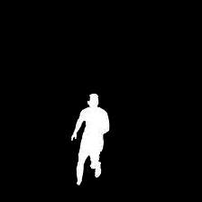 |
| **fg_bg_depth** | 400k | (224,224) | (0.4334) | (0.2715) | 1.6G | 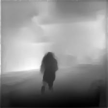 |

### Dataset Link

 - Link: https://drive.google.com/file/d/1KY-6ndddnDSXTp974YeubFKEMTbKmqiH/view?usp=sharing
 - Size:
	 - Zip: 5G
	 - Unzip: 7.3G 

### Dataset Visualization
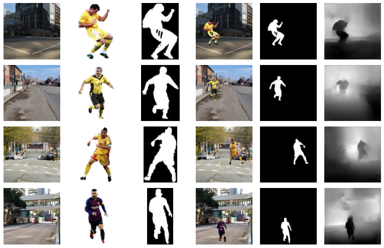

### Resources

 - Code to overlay foreground on background and corresponding masks: 
	 - 
 - Code to generate depth maps for foreground overlayed on background: 
	 - 
	 - [Forked Repo](https://github.com/uday96/DenseDepth/tree/cars_fg)
 - Code to compute the combine the dataset and analyse the statistics:
	 - 
