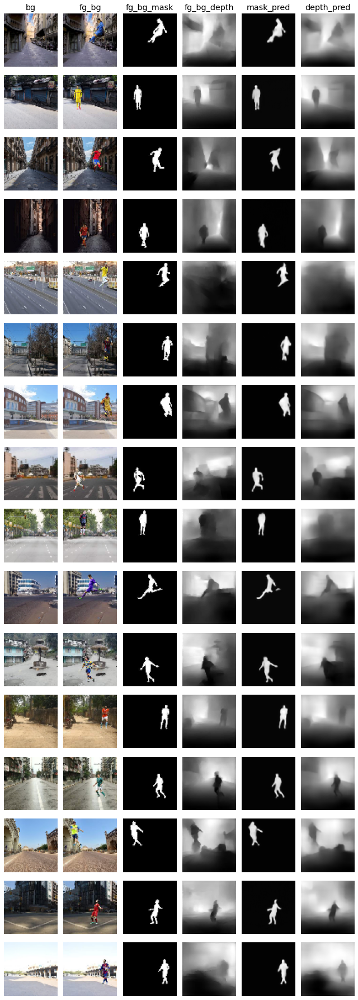
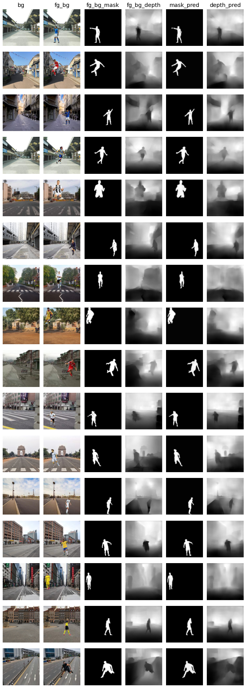
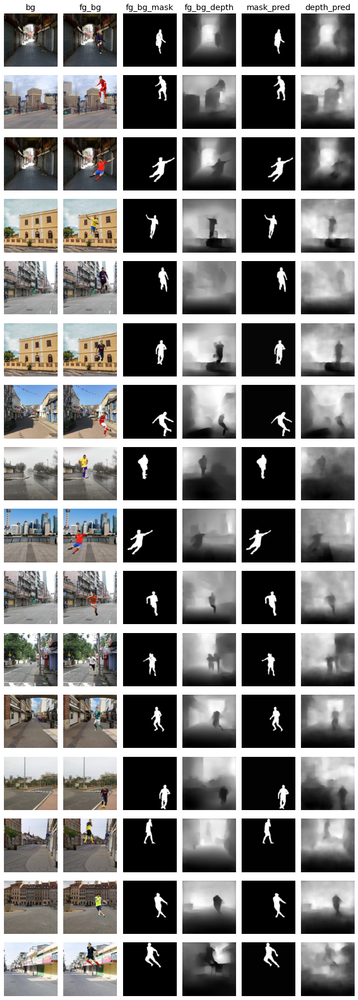

# Session 15 - Monocular Depth Estimation and Segmentation

### Objective
Given an image with foreground objects and background image, predict the depth map as well as a mask for the foreground object.

### Dataset
A custom dataset will be used to train this model, which consists of:
- 100 background images
- 400k foreground overlayed on background images
- 400k masks for the foreground overlayed on background images
- 400k depth maps for the foreground overlayed on background images

Dataset Link: https://drive.google.com/file/d/1KY-6ndddnDSXTp974YeubFKEMTbKmqiH/view?usp=sharing
Dataset Creation: [https://github.com/uday96/EVA4-TSAI/tree/master/S14-15](https://github.com/uday96/EVA4-TSAI/tree/master/S14-15)

#### Notations
- Background image: **bg**
- Foregroung overlayed on background: **fg_bg**
- Mask for fg_bg: **fg_bg_mask**
- Depth map for fg_bg: **fg_bg_depth**
- Mask prediction: **mask_pred**
- Depth map prediction: **depth_pred**

### Model

The inputs to the model are **bg** and **fg_bg**.
- bg: `[3 x 224 x 224]`
- fg_bg: `[3 x 224 x 224]`

The outputs of the model are **mask_pred** and **depth_pred**.
- mask_pred: `[1 x 224 x 224]`
- depth_pred: `[1 x 224 x 224]`

#### Architecture
The model follows an encoder-decoder architecture. It consists of a common encoder and two decoders, for mask prediction and depth map prediction respectively.
- The encoder uses ResNet blocks to extract the visual features.
- The decoder uses skip connections from the encoder and bilinear interpolation to upscale the features and construct the mask and depth maps.

#### Parameters Count

    --------------------------------------------------
    Total params: 3,165,170
    Trainable params: 3,165,170
    Non-trainable params: 0
    --------------------------------------------------
    Input size (MB): 1.15
    Forward/backward pass size (MB): 31581162963630.00
    Params size (MB): 12.07
    Estimated Total Size (MB): 31581162963643.22
    --------------------------------------------------

### Parameters and Hyperparameters

-   Optimizer: Adam
-   Scheduler: StepLR
-   Batch Size:
	- 64 for `64x64` and `128x128`
	- 16 for `224x224`
-   Dropout: 0.2
-   L2 decay: 0.0001

### Image Augmentation
- **Resize**:
	- Downscale the images to be able to traing for lower dimensions first.
	- Applied on **bg**, **fg_bg**, **fg_bg_mask** and **fg_bg_depth**.
- **RGBShift** & **HueSaturationValue**:
	- Used to reduce the dependency on image colours for prediction.
	- One of these was applied randomly to **bg** and **fg_bg** images.
- **GaussNoise**:
	- Gaussian noise was applied randomly to **bg** and **fg_bg** images.
- **Horizontal & Vertical Flip**:
	- Images were flipped randomly, both horizontally and vertically
	- Applied on **bg**, **fg_bg**, **fg_bg_mask** and **fg_bg_depth**.
	- Here, the same flip operations were applied on all the 4 images to maintain the orientation.
- **RandomRotate**:
	- Images were randomly rotated within (-15,15) degrees.
	- Applied on **bg**, **fg_bg**, **fg_bg_mask** and **fg_bg_depth**.
	- Here, the all the 4 images were rotated in the same direction and angle to maintain the orientation.
- **CoarseDropout**:
	- Used to force the network to extract more features by cutting out some parts of the image
	-  Applied randomly to **bg** and **fg_bg** images.

### Loss Function

The loss function used is a weighted average of:
- **L1 loss**: Handles the per pixel differences.
- **Structural Similarity Index (SSIM)**: Handles luminance, contrast and structural differences.
- **Edge Gradients**:  This computes the edges and tries to match the edges of the target and output. 

The overall loss was a summation of loss for mask and depth.

    loss = (w_ssim * l_ssim) + (w_depth * l_depth) + (w_edge * l_edge)
    loss = loss_mask + loss_depth

We can get results by just using **L1 loss** too, but using **SSIM** and **Edge gradients** helps in converging faster.

**Huber loss** can also be used but I observed that the predictions are sharper when we use **L1 loss** instead of huber.

**BCE loss** could construct the structure of the prediction but was not able to get a proper constrast for the mask and sharpness for mask and depth images.

### Accuracy Metrics

We need some metrics to help us understand how the model is performing and to be able to compare two models. The notion of accuracy is different here because we have to compare two images.

#### Root Mean Squared Error (RMS)
- RMS is based on the per pixel differences.
- This measure is in the context of the images being absolutely the same.
- The lower the RMS error, the better the predictions

Calculation:

    rmse = torch.sqrt(torch.nn.MSELoss()(gt, pred))

#### t < 1.25
- The idea here is that, the pixel values need not be asolutely the same.
- We take the ratio of each pixel and verify if the it is within a scale of 1.25
- This measure is in the context of the images being relatively the same.
- The higher the `t<1.25` value, the better the predictions
- Similarly calculate `t<1.25^2`  and `t<1.25^3`

While calculating `t<1.25`, we want the ratio of pixels to within a threshold i.e 1.25. But if the value of pixel is less than 0.1 then even though the pixel values are close the ratio scale changes.
For ex, 0.00001 and 0.000001 are very close and we want them to contribute positively for our accuracy but the ratio is 10 which reduces the accuracy. So we clamp the tensors to 0.1 and 1.  

Calculation:

	gt = torch.clamp(gt, min=0.1, max=1)
    pred = torch.clamp(pred, min=0.1, max=1)

    thresh = torch.max((gt / pred), (pred / gt))

    a1 = (thresh < 1.25   ).float().mean()
    a2 = (thresh < 1.25 ** 2).float().mean()
    a3 = (thresh < 1.25 ** 3).float().mean()

### Training and Validation

The model was first trained on smaller resolutions of `64x64` first. Then trained on `128x128` and finally on `224x224`.

Since there are storage and compute restrictions on colab, I was not able to use large batch sizes for higher resolutions and this in turn was increasing the time taken per epoch.
To handle this, I was saving the predictions and model after a chunk of batches to be able to monitor the progress while running for a small number of epochs. Using the saved model, I could again load it and continue training the model.

For `224x224` each epoch was taking ~2hrs to train. So I was able to train it for 3 epochs at a stretch, save the model and resume training later.

### Results

#### 64x64
Dimensions:

    bg         : [3, 64, 64]
    fg_bg      : [3, 64, 64]
    fg_bg_mask : [1, 64, 64]
    fg_bg_depth: [1, 64, 64]
    mask_pred  : [1, 64, 64]
    depth_pred : [1, 64, 64]

Validation Metrics:

    Test set: Average loss: 0.1857, Average MaskLoss: 0.0411, Average DepthLoss: 0.1445
      
    Metric:  t<1.25,   t<1.25^2   t<1.25^3,   rms
    Mask  :  0.9808,   0.9866,    0.9900,    0.0604
    Depth :  0.7569,   0.9244,    0.9743,    0.0909
    Avg   :  0.8688,   0.9555,    0.9822,    0.0757
    
    
Visualization:

#### 128x128

Dimensions:

    bg         : [3, 128, 128]
    fg_bg      : [3, 128, 128]
    fg_bg_mask : [1, 128, 128]
    fg_bg_depth: [1, 128, 128]
    mask_pred  : [1, 128, 128]
    depth_pred : [1, 128, 128]

Validation Metrics:

    Test set: Average loss: 0.1474, Average MaskLoss: 0.0253, Average DepthLoss: 0.1221
  
	Metric:  t<1.25,   t<1.25^2,  t<1.25^3,   rms
	Mask  :  0.9891,   0.9925,    0.9947,    0.0409
	Depth :  0.7558,   0.9205,    0.9722,    0.0926
	Avg   :  0.8725,   0.9565,    0.9834,    0.0667
    
    
Visualization:

#### 224x224

Dimensions:

    bg         : [3, 224, 224]
    fg_bg      : [3, 224, 224]
    fg_bg_mask : [1, 224, 224]
    fg_bg_depth: [1, 224, 224]
    mask_pred  : [1, 224, 224]
    depth_pred : [1, 224, 224]

Validation Metrics:

    Test set: Average loss: 0.1446, Average MaskLoss: 0.0231, Average Depthloss: 0.1214

	Metric:  t<1.25,   t<1.25^2,  t<1.25^3,   rms
	Mask  :  0.9923,   0.9946,    0.9961,    0.0350
	Depth :  0.7280,   0.9028,    0.9623,    0.1015
	Avg   :  0.8601,   0.9487,    0.9792,    0.0682
    
    
Visualization:

