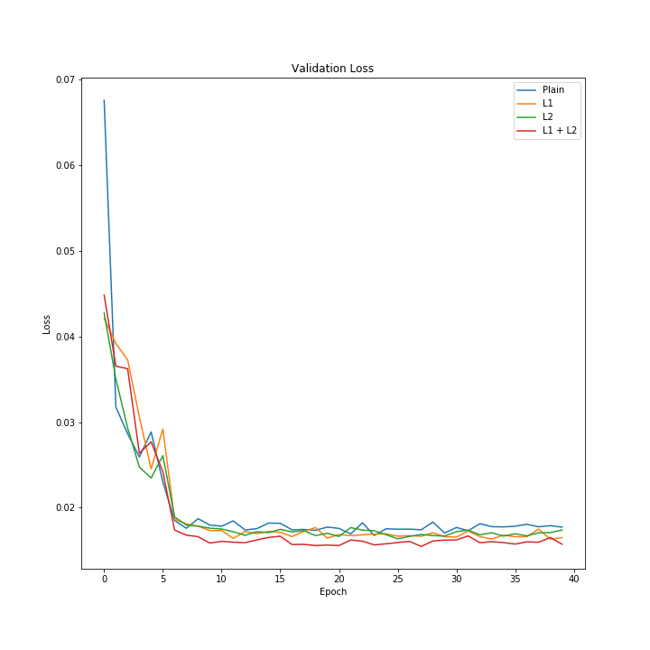
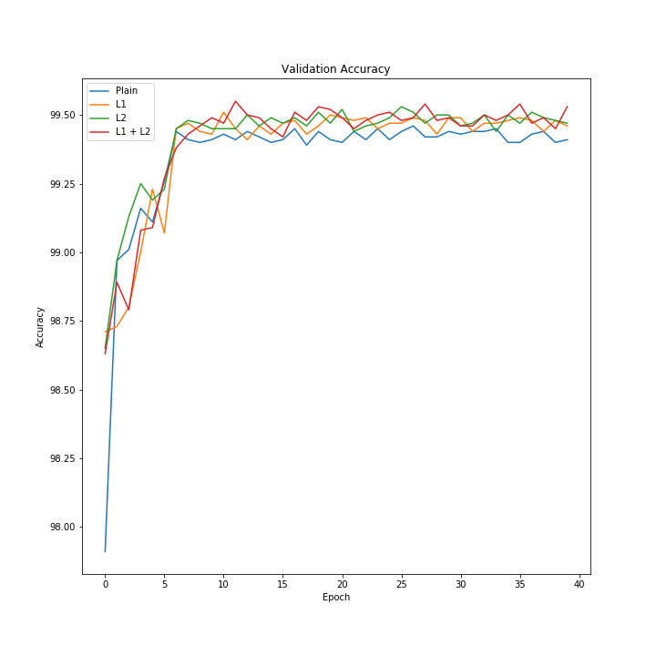
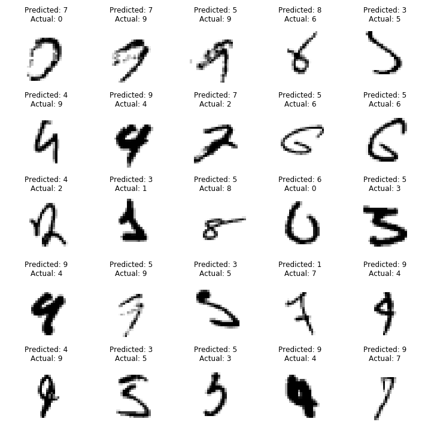
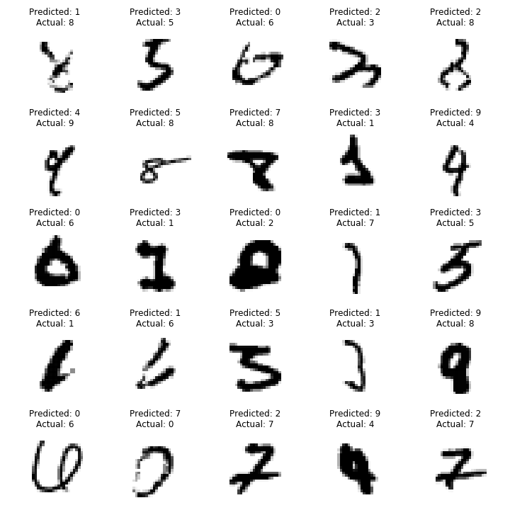

# Session 6 - Regularization

###	Objective
Using the Session 5 code, run the model for 40 epochs and compare

-	Without L1 and L2 regularization
-	With L1 regularization
- 	With L2 regularization
-	With L1 and L2 regularization

Plot the validation loss and accuracy changes for the models.

Plot 25 misclassified images for models with L1 regularization and L2 regularisation.

###  Parameters and Hyperparameters

- Loss Function: Negative Log Likelihood
- Optimizer: SGD
- Batch Size: 32
- Learning Rate: 0.01
- Dropout: 0.05
- Epochs: 40
- L1 decay: 0.00005
- L2 decay: 0.0003

### Results

#### Validation Loss

#### Validation Accuracy

#### Misclassified Images - L1 regularization 

#### Misclassified Images - L2 regularization 

