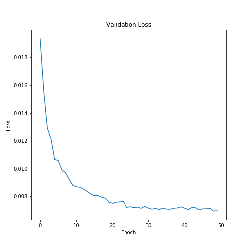
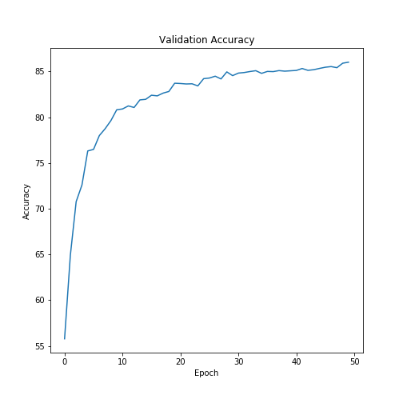
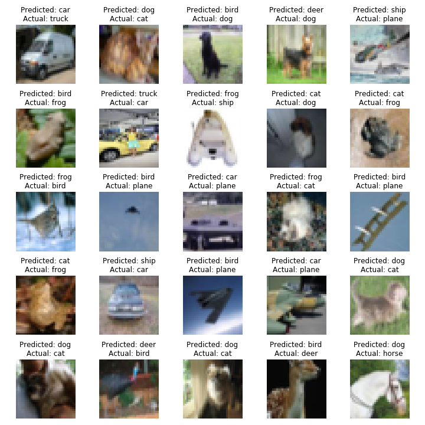

# Session 7 - Advanced Convolutions

###	Objective
Achieve an accuracy of **80%** on the **CIFAR-10** dataset with the following constraints:

-	Use the architecture  C1C2C3C4O (basically 3 MPs)
-	Total RF must be more than 44
- 	Use Depthwise Separable Convolution
-	Use Dilated Convolution
-	Less than 1M parameters

Plot the validation loss and accuracy changes for the models.

Plot 25 misclassified images.

###  Parameters and Hyperparameters

- Loss Function: Cross Entropy Loss
- Optimizer: SGD
- Batch Size: 64
- Learning Rate: 0.01
- Dropout: 0.15
- Epochs: 50

### Results
Achieved  an accuracy of **86.01%** in 50 epochs.

#### Validation Loss

#### Validation Accuracy

#### Misclassified Images

