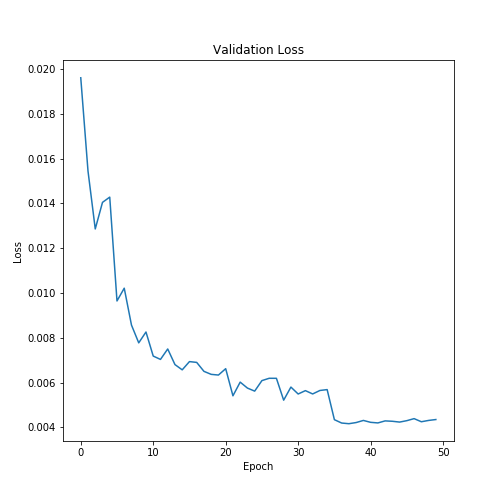
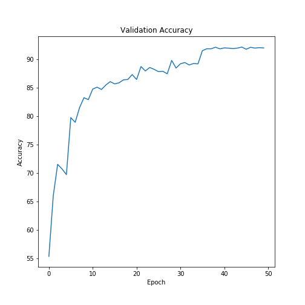
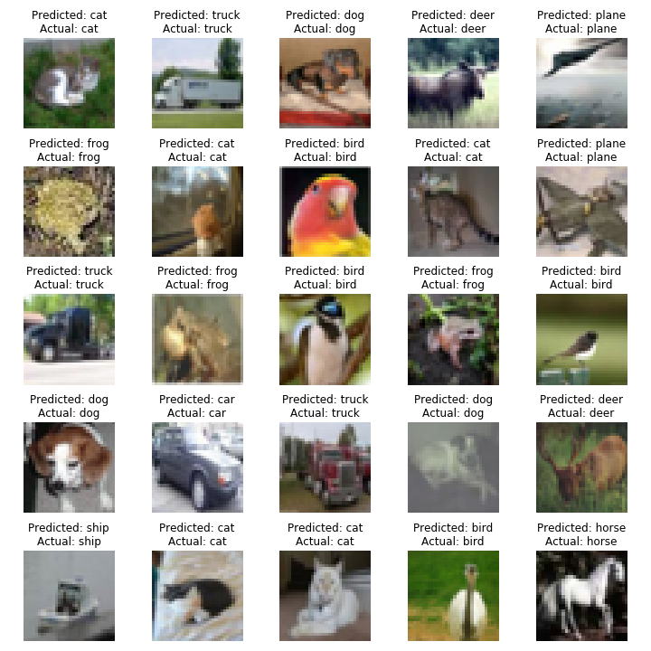
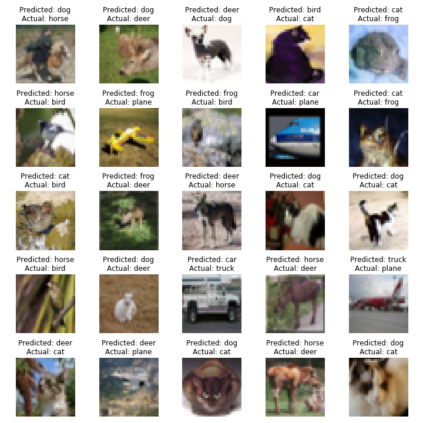

# Session 8 - Receptive Fields and Network Architecture

###	Objective
Achieve an accuracy of **85%** on the **CIFAR-10** dataset using **ResNet18**

###  Parameters and Hyperparameters

- Loss Function: Cross Entropy Loss
- Optimizer: SGD
- Batch Size: 64
- Learning Rate: 0.01
- Dropout: 0.15
- Epochs: 50
- Dropout: 0.15
- L1 decay: 1e-6
- L2 decay: 1e-3

### Image Augmentation Techniques
- Random Horizontal Flip: 0.5
- Random Crop: 32
- Random Rotation: 10
- Random Erasing: 0.25

### Results
Achieved  an accuracy of **92.19%** in 45th epoch.

#### Validation Loss

#### Validation Accuracy

#### Correctly Classified Images

#### Misclassified Images

