# Session 9 - Data Augmentation and GradCAM

###	Objective
Achieve an accuracy of **87%** on the **CIFAR-10** dataset using **ResNet18**:

-  Use Albumentations for image augmenation
- Implement Grad-CAM: Gradient-weighted Class Activation Mapping

###  Parameters and Hyperparameters

- Loss Function: Cross Entropy Loss
- Optimizer: SGD
- Scheduler: OneCycleLR
- Batch Size: 64
- Learning Rate: lr=0.1, max_lr=0.01
- Epochs: 35
- Dropout: 0.15
- L1 decay: 1e-6
- L2 decay: 1e-3

### Image Augmentation Techniques

- Horizontal Flip: p=0.5
- Hue Saturation Value: p=0.25
- Rotate: limit=15, p=0.5
- Coarse Dropout: holes=1, h=(4,16), w=(4,16), p=0.75

### Results
Achieved  an accuracy of **92.14%** in 33rd epoch.

#### Validation Loss
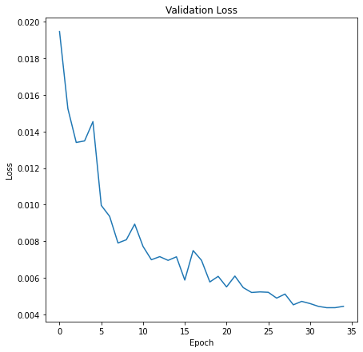

#### Validation Accuracy
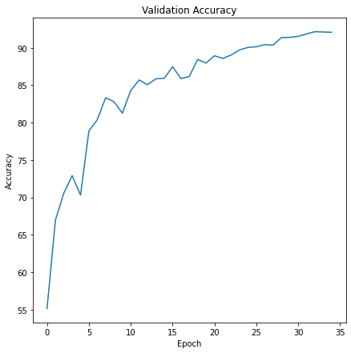

#### Correctly Classified Images
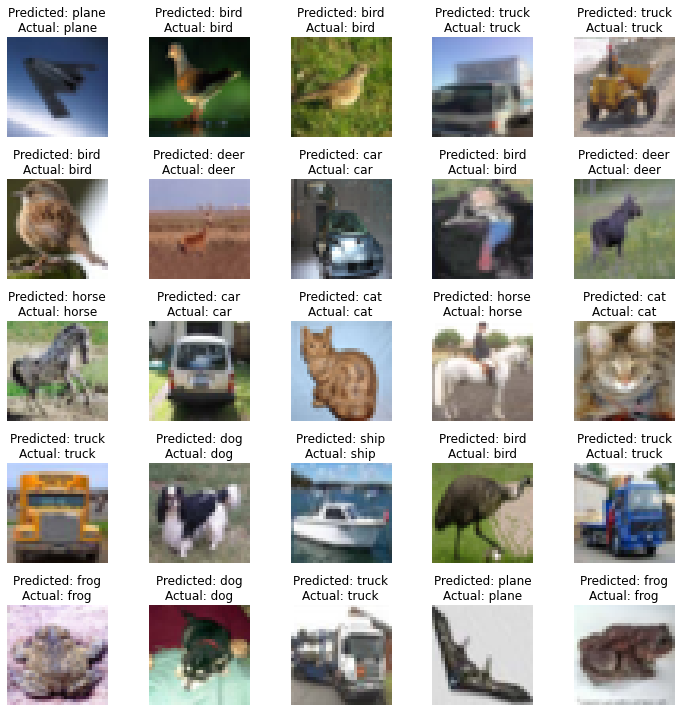

#### Misclassified Images
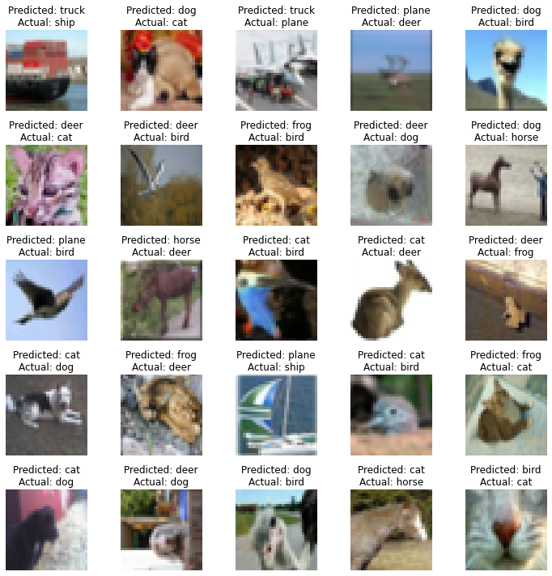

### GradCAM Visualizations

Visualize GradCAM at different convolutional layers to understand where the network is looking at while prediction.

#### Correctly Classified Images

##### GradCAM at different convolutional layers for the class: *Plane*

| Truth: Plane, Predicted: Plane |
|---|
| 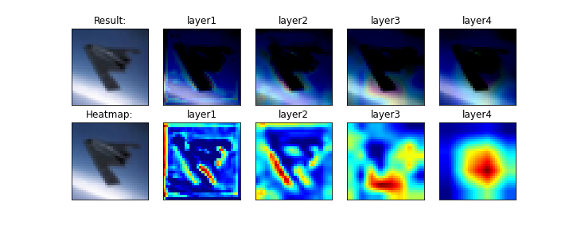  |

##### GradCAM at different convolutional layers for the class: *Bird*

| Truth: Bird, Predicted: Bird |
|---|
|  |

##### GradCAM at different convolutional layers for the class: *Bird*

| Truth: Bird, Predicted: Bird |
|---|
| 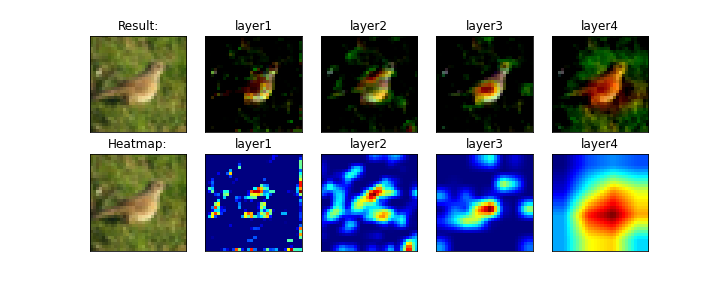 |

##### GradCAM at different convolutional layers for the class: *Truck*

| Truth: Truck, Predicted: Truck |
|---|
| 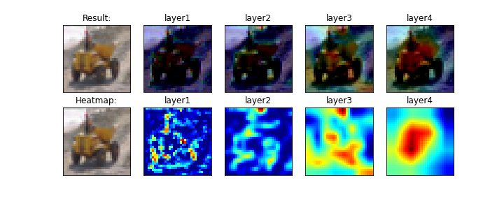 |

##### GradCAM at different convolutional layers for the class: *Truck*

| Truth: Truck, Predicted: Truck |
|---|
| 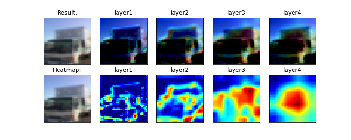 |

#### Misclassified Images

##### GradCAM at different convolutional layers for the class: *Truck*

| Truth: Ship, Predicted: Truck |
|---|
| 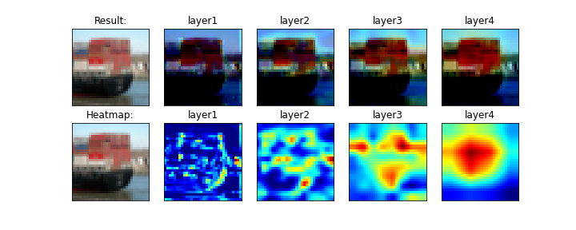 |

##### GradCAM at different convolutional layers for the class: *Dog*

| Truth: Cat, Predicted: Dog |
|---|
| 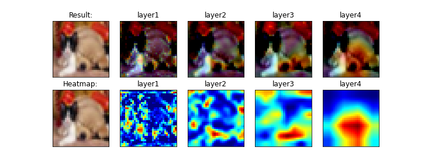 |

##### GradCAM at different convolutional layers for the class: *Truck*

| Truth: Plane, Predicted: Truck |
|---|
| 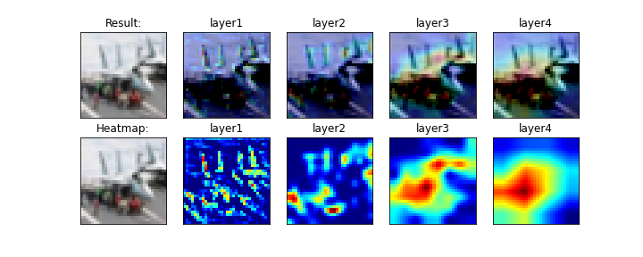 |

##### GradCAM at different convolutional layers for the class: *Plane*

| Truth: Deer, Predicted: Plane |
|---|
| 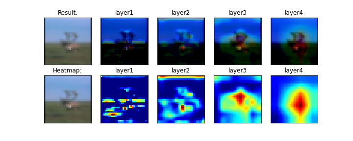 |

##### GradCAM at different convolutional layers for the class: *Dog*

| Truth: Bird, Predicted: Dog |
|---|
| 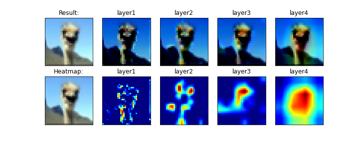 |
